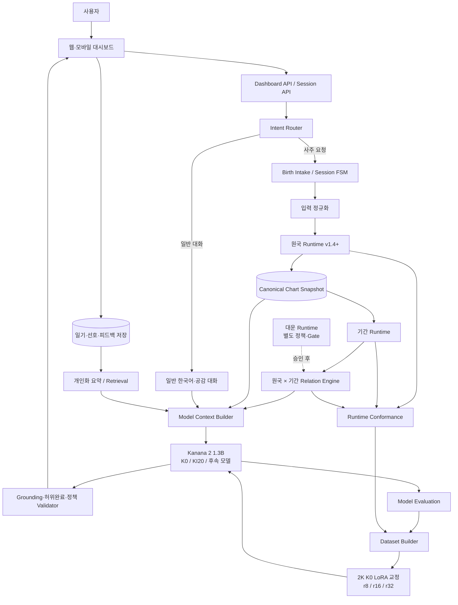

# 01. 사주 일기 Assistant 전체 프로젝트 구조·통합 로드맵

- 저장소: `sgim49697-ops/saju_diary_assistant`
- 기준 브랜치: `master`
- 기준 커밋: `9be784e4fb7f937865cdff66b95d725f61081b25`
- 기준 시각: 2026-09-02 22:34 KST
- 문서 최초 작성: 2026-09-02 11:36 KST
- 보존 기준선: `KI20-MIX-v2/run-1f5d732cae67`, `saju-runtime-release-v1.4.0-63dc8d398e90`
- 공통 상태: 기존 KI10·KI20·평가 split·sealed blind·v1.4 chart-only release는 불변 보존

## 문서 역할

이 문서는 세 계획서의 상위 정본이다. 프로젝트의 제품 목표, 전체 모듈 구조, 현재 위치, workstream 간 의존성, 릴리스 순서와 승인 Gate를 정의한다.

- Runtime·기간 계산·실제 대시보드 구현 세부사항은 [`02_SAJU_RUNTIME_PERIOD_DASHBOARD_PLAN.md`](02_SAJU_RUNTIME_PERIOD_DASHBOARD_PLAN.md)가 소유한다.
- 모델 비교·평가·학습 데이터·K0 기반 LoRA 교정 세부사항은 [`03_SAJU_MODEL_EVALUATION_AND_DATA_PLAN.md`](03_SAJU_MODEL_EVALUATION_AND_DATA_PLAN.md)가 소유한다.
- 이 문서는 두 하위 계획의 결과를 하나의 제품 아키텍처로 연결하되, 계산 알고리즘이나 데이터 생성 절차를 중복 정의하지 않는다.

---

## 1. 최신 커밋 기준 최종 판정

최신 `master`는 원국 계산기 자체와 원국 전용 앱 결합을 상당히 진행했다. 그러나 현재 운영 승인은 명확히 **과거 공식 원국 전용(chart-only)**이다.

현재 승인된 사실은 다음과 같다.

| 영역 | 최신 상태 | 근거 | 다음 Gate |
|---|---|---|---|
| KI10·KI20 Full FT | 완료 | KI20 20K, 1 epoch, 2,500 step, final reload 완료 | 의미 품질 비교와 자동 repair |
| 원국 계산 Runtime | 제한 승인 | `1920-01-07~2026-08-31`, 대한민국·`Asia/Seoul`, v1.4 chart-only | 지원 범위 확대가 아니라 기간 Runtime 분리 |
| 원국 → 앱 연결 | 제한 운영 | dashboard v1.11이 승인 원국과 단일 일진을 실제 대화 context에 전달 | v1.11 운영선 보존 |
| 오늘·기간 계산 | 후보 검증 완료 | 공식 일별 label release, 1~31일 범위 Runtime, dashboard v1.12 후보 | 운영 승격은 별도 승인 |
| 원국 × 기간 관계 | 단일 날짜 후보 검증 완료 | 별도 relation release와 dashboard v1.13 후보, 범위 relation은 차단 | 모델·제품 canary 뒤 승격 판단 |
| 대운 계산 | 미승인 | profile·기운 시작점·순역·환산 정책 미결 | 별도 `daeun` workstream |
| 전문 통변 | 의미 품질 미측정 | 현재 Phase 6는 기술 계약 중심 | 전문가/사용자 blind 평가 |

첨부된 현재 위치 도식은 방향상 정확하다. 다만 “오늘/기간 계산”과 “대운 계산”을 하나의 미래운 기능으로 묶지 않고, 아래처럼 계층을 분리해야 프로젝트가 덜 꼬인다.

```text
원국 계산
  → 오늘 일진·세운·월운 같은 기간 사실
  → 원국과 기간의 구조적 관계
  → 질문별 자연어 해석
  → 장기 대운
  → 대운·세운·월운을 함께 보는 전문 통변
```

현재 프로젝트가 헤맨 가장 큰 이유는 “대운이 어려워서”만이 아니다. 지금까지 해결한 난제의 상당수는 **LLM이 계산하면 안 되는 영역을 분리하고, 계산 결과를 세션·도구·대시보드에 안전하게 전달하는 기반 공사**였다. 대운은 그 기반 위에 올라가는 별도 난관이다.

---

## 2. 제품 목표와 성공 기준

### 2.1 제품 정의

이 프로젝트의 목표는 전문 유료 명리 상담 시스템을 그대로 복제하는 것이 아니다. 사용자가 부담 없이 다음을 할 수 있는 경량형 한국어 사주·일기 Assistant다.

- 출생정보를 한 번 입력하고 원국을 확인한다.
- 오늘·주말·월간 흐름을 가볍게 확인한다.
- 성격·직업·재물·관계 질문에 사주 관점의 참고 설명을 받는다.
- 힘든 감정이나 일기를 이야기할 때 사주를 강요하지 않는 자연스러운 대화를 한다.
- 이전 입력과 답변을 바탕으로 후속 질문을 이어간다.
- 계산 사실과 해석 의견이 섞이지 않도록 한다.

### 2.2 성공 기준

제품 성공은 “실제 미래 사건을 과학적으로 맞힌다”가 아니라 다음으로 정의한다.

1. 동일한 입력·정책·버전이면 계산 결과가 항상 같다.
2. 모델은 Runtime이 주지 않은 원국·간지·기간 사실을 만들지 않는다.
3. 사용자가 이미 제공한 정보는 다시 묻지 않는다.
4. 일반 감정 대화에 불필요하게 사주 입력을 요구하지 않는다.
5. 답변이 한국어로 자연스럽고, 일반 LLM보다 사주 맥락을 더 정확히 활용한다.
6. 운세는 단정적인 사건 예측보다 “참고 흐름·주의점·선택지”로 제공한다.
7. 장기 대운은 별도 정책과 전문가 검증이 끝나기 전까지 노출하지 않는다.

---

## 3. 전체 시스템 아키텍처



### 3.1 핵심 책임 분리

| 계층 | 담당 | 하지 않는 일 |
|---|---|---|
| UI·대시보드 | 입력, 상태 표시, 결과 탐색, 오류·불확실성 UX | 원국·간지 계산 |
| Session FSM | slot, correction, provenance, revision, chart/period snapshot 연결 | 사주 통변 |
| 원국 Runtime | 음양력, 시간대, 절입, 네 기둥, 승인 deterministic fact | 상담 문장 생성 |
| 기간 Runtime | 목표 날짜의 세운·월운·일운, 기간 segment | 사건 예측 |
| Relation Engine | 원국과 기간의 십신·직접 관계 존재 검출 | 관계 우선순위·길흉 단정 |
| LLM | 질문 이해, 사실 선택, 쉬운 한국어 설명, 공감, 후속 대화 | 직접 원국·기간 계산 |
| Validator | 입력 밖 사실·허위 완료·잘못된 tool 사용 차단 | 답변을 대신 작성 |
| Dataset Builder | 승인 Runtime snapshot으로 tool/state 데이터 생성 | 미승인 계산을 Gold로 승격 |
| Evaluation | K0·KI20·후속 모델의 구조적·의미적 차이 측정 | loss만으로 품질 인증 |
| Daeun Engine | 순역·기운 시점·대운 배열 | 원국 release에 슬쩍 포함 |

---

## 4. 사실 권위와 해석 계층

모든 모듈은 아래 공통 등급을 사용한다.

| 등급 | 의미 | 예시 | 모델 처리 |
|---|---|---|---|
| `SOURCE_HARD_FACT` | 공식 원천이 직접 제공하거나 공식 fixture로 검증한 사실 | KASI 음양력·일진, IANA offset | 사실로 사용 가능 |
| `PROFILE_DETERMINISTIC` | 입력과 profile을 고정하면 재현되는 계산 | 원국, 절입 기준 월주, 십신 | `policy_id`와 함께 사용 |
| `FORECAST_PROFILE_DETERMINISTIC` | 고정 provider·profile로 계산한 현재·미래 기간 사실 | 오늘 월운·일운, 향후 세운 | 불확실성과 source version 표시 |
| `SOFT_INTERPRETATION` | 질문과 상담 맥락에 따른 해석 | 직업·재물·관계 설명 | 단정 금지, 근거 fact 연결 |
| `HEURISTIC_ONLY` | 자동 점수·유파·임계값 의존 | 자동 신강약·격국·용신 | tool fact·자동 Gold 금지 |

이 분리를 공통 계약으로 사용해야 문서 02의 Runtime 결과와 문서 03의 학습 데이터가 동일한 의미를 갖는다.

---

## 5. 공통 데이터 흐름

### 5.1 원국 요청

```text
사용자 출생정보
→ FSM이 빠진 항목만 확인
→ 입력 정규화
→ chart-only Runtime
→ chart snapshot 저장
→ LLM에 allowlist fact만 전달
→ 질문 초점에 맞는 원국 설명
```

### 5.2 오늘의 흐름 요청

```text
“오늘 어때?”
→ Intent Router가 일반 대화와 period 요청을 구분
→ Runtime이 기준 시각·timezone으로 오늘 날짜 확정
→ Session에서 현재 chart snapshot 조회
→ 기간 Runtime이 세운·월운·일운 계산
→ Relation Engine이 원국과의 관계 fact 생성
→ LLM이 참고 흐름으로 설명
→ Validator가 미제공 간지·사건 단정 차단
```

### 5.3 일반 감정 대화

```text
“오늘 너무 힘들었어”
→ 사주 opt-in 없음
→ 사주 입력·기간 계산 요청하지 않음
→ 공감과 현실적 질문 중심으로 응답
→ 사용자가 “사주 관점에서도 봐줘”라고 할 때만 chart/period 경로 사용
```

### 5.4 장기 대운 요청

```text
대운 feature 미승인
→ 현재는 지원 범위 안내
→ 원국·올해·월간 수준의 참고 흐름만 대안 제공
→ Daeun Gate 통과 뒤 별도 release로 연결
```

---

## 6. 릴리스 트랙과 의존성

| Track | 산출물 | 현재 | 다음 조건 |
|---|---|---|---|
| `TR-CHART` | 원국 Runtime | v1.4 제한 승인 | 현 release 불변 유지 |
| `TR-APP-CHART` | 원국+단일 일진 대시보드 | v1.11 제한 운영 | 운영선 유지 |
| `TR-PERIOD-DAY` | 오늘·특정 날짜 계산 | release·전수 검증 완료 | 운영 승격 별도 승인 |
| `TR-PERIOD-RANGE` | 1~31일 기간 label | Runtime·dashboard v1.12 후보 | 실제 운영 canary·승격 |
| `TR-RELATION` | 원국 × 단일 날짜 관계 | release·dashboard v1.13 후보 | 범위 relation 차단 유지 |
| `TR-MODEL-EVAL` | K0·KI20 semantic A/B | 구조 평가 일부 완료 | 문서 03 blind 평가 |
| `TR-DATA-V4` | production-like correction 2K | spec 2,000·dev 200·교차 teacher pilot 완료 | 전체 teacher 생성·전수 token audit |
| `TR-MODEL-V4` | K0 기반 LoRA | 실행기·r8/r16/r32 계약 완료, 학습 미실행 | GPU preflight 뒤 1 epoch 비교 |
| `TR-DAEUN` | 대운 계산 | 미구현 | 독립 정책·전문가 Gate |
| `TR-PRODUCT` | 개인화 앱 | chart-only 제한 | period+model canary 후 |

### 의존성 원칙

```text
TR-PERIOD-DAY·RELATION 후보 검증
   ↓
TR-DATA-V4 교차 teacher 생성·검수
   ↓
TR-MODEL-V4 K0 LoRA 2K diagnostic
   ↓
TR-PRODUCT 오늘 운세 활성화
```

`TR-DAEUN`은 위 흐름의 필수 선행조건이 아니다. 오늘·주말·월간 기능을 먼저 완성하고, 대운은 이후 독립적으로 추가한다.

---

## 7. 세 계획서가 공유할 공통 계약

### 7.1 공통 입력 식별자

- `session_id`: 암호화 session record 식별자
- `birth_input_id`: 정규화 전후 출생입력 provenance 연결
- `chart_id`: 단일 원국이 확정된 경우
- `chart_set_id`: 생시 범위·미상으로 후보가 여러 개인 경우
- `period_id`: chart snapshot + 기간 + period policy의 versioned ID
- `relation_snapshot_id`: chart + period + relation table version의 ID
- `model_context_id`: 모델에게 실제 전달한 allowlist context의 hash

### 7.2 공통 버전 필드

```text
policy_id
engine_version
calculation_schema_version
period_policy_id
relation_policy_id
source_versions
tzdb_version
model_revision
chat_template_sha256
```

### 7.3 공통 불변 자산

- `KI10-MIX-v2`
- `KI20-MIX-v2/run-1f5d732cae67`
- 기존 Phase 6 sealed blind 결과와 consumption marker
- 기존 v1.4 release와 conformance report
- 기존 v3.0.1 candidate fingerprint

새 기능은 새 version·새 build로만 추가한다.

---

## 8. 전체 모듈 구조 권장안

```text
configs/
├── runtime/
│   ├── calculation/                 # 원국 정본·profile·release
│   ├── period/                      # 오늘/기간 정책·schema·release
│   ├── relations/                   # 십신·합충 관계표와 authority
│   ├── operations/                  # 대시보드 binding·security·canary
│   └── model_context/               # 모델 allowlist·context pack 계약
├── evaluation/
│   ├── runtime/
│   └── model/
└── data_versions/
    └── saju_1b_baseline/

scripts/
├── runtime/
│   ├── calculation/
│   ├── period/
│   ├── relations/
│   ├── context_builder/
│   └── dashboard/
├── evaluation/
│   ├── saju_runtime/
│   └── model_semantic/
├── data/
│   └── mix20k_v3_1/
└── training/
    └── v3_1/

tests/
├── fixtures/
│   ├── saju_external_conformance/
│   ├── period_conformance/
│   └── relation_conformance/
└── ...

data/reports/
├── saju_runtime_conformance/
├── saju_period_conformance/
├── saju_dashboard_canary/
├── saju_model_semantic/
└── saju_1b_baseline/
```

기존 파일을 대규모 이동하지 않는다. 새 workstream을 versioned directory에 추가하고, 과거 정본 경로는 유지한다.

---

## 9. 통합 로드맵

### P0. 기준선 동결 — 완료

- KI20 학습·reload 완료
- Phase 6 단회 평가 완료
- v1.4 chart-only release 승인
- dashboard v1.11 원국+단일 일진 제한 운영

### P1. Day-only Period Runtime — 후보 검증 완료

- 오늘·특정 날짜 기준 시각 정규화
- 일진·세운·월운 사실 분리
- process cache 의존 제거
- 상대 날짜 resolver
- period authority와 warning schema

상세: 문서 02.

### P2. 원국 × 단일 날짜 Relation — 후보 검증 완료

- 기간 천간·지지의 일간 기준 십신
- 원국 각 기둥과 직접 합·충·형·파·해 존재
- 관계 “존재”와 관계 “해석” 분리
- relation snapshot Gate

### P3. 실제 대시보드 오늘/기간 기능 — v1.12·v1.13 후보 검증 완료

- 원국·오늘·기간 탭
- 절입 경계·생시 미상·지원 밖 UX
- 같은 chart snapshot을 K0·KI20에 전달
- security/rate/retention 회귀

### P4. 모델 Semantic A/B

- K0 vs KI20 동일 Runtime context
- 구조 지표와 사람 blind 평가 분리
- 일반 대화 보존 평가
- 오늘/기간 grounded response 평가

상세: 문서 03.

### P5. MIX2K-v4 LoRA Diagnostic — 실행 준비 완료

- dashboard v1.11과 같은 full runtime snapshot 기반 2,000행 spec 구성
- K0-INSTRUCT 고정 revision에서 r8·r16·r32 LoRA 1 epoch 비교
- K0 untouched·KI20·세 LoRA를 동결 dev 200건에서 비교
- 통과하지 못하면 10K·20K 금지

### P6. MIX10K/20K-v3.1

- 10K 독립 run
- 기준 통과 시 20K 독립 run
- no-regression + semantic win + tool/state Gate 필요

### P7. 대운 별도 workstream

- `KR_DAEUN_POLICY_V1`
- 순역·인접 절·환산·표시 나이 계약
- 전문가 fixture
- chart/period release와 별도 승인

### P8. 개인화·일기 피드백

- 사용자가 직접 남긴 체크·일기·피드백 요약
- 모델 파라미터 즉시 업데이트가 아니라 retrieval/profile 우선
- 충분한 개인 데이터와 opt-in이 쌓인 뒤 adapter/LoRA 연구

---

## 10. 통합 Gate

| Gate | 핵심 조건 | 소유 문서 |
|---|---|---|
| `ARCH-G1` | 모듈 책임과 authority 중복 0 | 본 문서 |
| `RUNTIME-G1` | day fact 공식/정책 mismatch 0 | 문서 02 |
| `RUNTIME-G2` | 절입 경계 segment 100% | 문서 02 |
| `APP-G1` | HTTP·보안·session·누출 canary 통과 | 문서 02 |
| `MODEL-G1` | K0·KI20 동일 context semantic A/B 완료 | 문서 03 |
| `DATA-G1` | v3.1 tool result provisional 0 | 문서 03 |
| `TRAIN-G1` | 2K diagnostic가 KI20 대비 workflow 개선 | 문서 03 |
| `DAEUN-G1` | 정책·전문가 fixture 승인 | 후속 별도 문서 |
| `PRODUCT-G1` | Runtime+Model+UX canary 동시 통과 | 본 문서 종합 |

어느 한 Gate도 다른 Gate를 자동으로 승인하지 않는다. 예를 들어 Runtime 계산 정확성이 모델 해석 품질을 보증하지 않고, 모델 답변 선호도가 계산 정확성을 보증하지 않는다.

---

## 11. 주요 위험과 대응

| 위험 | 현재 징후 | 대응 |
|---|---|---|
| chart-only 성공을 전체 만세력 완성으로 오인 | period가 계속 blocked | release 이름과 capabilities 분리 |
| 미래 절입을 과거 공식 hard fact로 취급 | strict provider Gate 실패 | `FORECAST_PROFILE_DETERMINISTIC` 도입 |
| LLM이 chart/period ID를 생성 | tool schema v1의 `chart_id` 요구 | executor-injected ID로 변경 |
| process 재시작 뒤 period 불가 | chart cache in-process only | 암호화 snapshot 재검산 또는 재계산 |
| 관계 fact와 길흉 해석 혼합 | relation engine 미정 | relation table과 interpretation 분리 |
| 기존 FT 효과를 loss로만 판단 | domain semantics `not_measured` | 동일 snapshot semantic A/B |
| v3 후보가 중복·미검수 상태로 학습 | 2,035 duplicate 참여, review 미완료 | diversity/review Gate |
| production-like 입력을 768로 절단 | 실제 입력이 약 1,600~1,700 token | 입력·출력 각 4,096 안전 상한, 전수 audit 후 truncation 없는 최소 `max_length` 선택 |
| 대운 때문에 전체 일정 정체 | 별도 정책 미결 | 오늘/기간과 독립 track |

---

## 12. Codex 실행 원칙

1. 작업 시작 시 반드시 `git fetch` 후 `master`가 이 문서 기준 commit 이상인지 확인한다.
2. 최신 commit이 바뀌었으면 run manifest·release registry·dashboard canary·project status를 다시 읽고 차이를 기록한다.
3. 기존 KI10·KI20·sealed blind·v1.4 release·기존 report를 수정하지 않는다.
4. 한 PR/commit에서는 하나의 workstream만 변경한다.
5. 코드 → 단위 테스트 → conformance/canary → 공개 aggregate·manifest → 문서 갱신 순서를 지킨다.
6. 실행하지 않은 성능 수치를 문서에 쓰지 않는다.
7. 외부 엔진 다수결을 정답으로 사용하지 않는다.
8. soft interpretation을 deterministic fact로 승격하지 않는다.
9. 새 20K 학습을 먼저 실행하지 않는다.
10. 본 문서의 roadmap 상태는 문서 02·03의 실제 Gate 결과가 생긴 뒤에만 갱신한다.

---

## 진행 기록

### 2026-09-02 — 최신 Runtime·LoRA 기준 반영

- 작업 요약: `master`에 병합된 기간·관계 Runtime 후보와 K0 기반 MIX2K-v4 LoRA 교정 계약을 상위 로드맵에 반영했다.
- 변경 범위: dashboard v1.11 운영선, v1.12·v1.13 후보, 2,000행 spec·dev 200건·교차 teacher·r8/r16/r32 비교 상태만 갱신했다. KI20과 기존 불변 release는 보존했다.
- 검증: 세 계획서 내부 링크, 최신 기준 commit, 금지된 768/Full FT 우선 지시와 `git diff --check`를 확인한다.
- 남은 작업: 전체 2,000행 teacher 생성·교차검수, 완성 target token audit, GPU LoRA 학습, 5-arm 평가와 production 승격은 미실행이다.

---

## 13. 내부 근거 파일

- `README.md`
- `configs/data_versions/saju_1b_baseline/project-status-v1.3.0.json`
- `configs/runtime/calculation/releases/v1.4.0/release_registry.json`
- `docs/runtime/chart_only_operations.md`
- `docs/runtime/known_limitations.md`
- `data/reports/saju_runtime_dashboard_canary/v1.0.0/build-ea53c272c1d6/aggregate.json`
- `data/reports/saju_1b_baseline/grounded-dialogue-rescore/v0.1.2/eval-562c07d0e2e6/aggregate.json`
- `data/reports/saju_1b_baseline/grounded-dialogue-context/v0.1.1/eval-56d1357560d5/aggregate.json`

## 14. 외부 참고

- 한국천문연구원 음양력 정보 OpenAPI: https://www.data.go.kr/dataset/15012679/openapi.do
- 한국천문연구원 특일·24절기 OpenAPI: https://www.data.go.kr/data/15012690/openapi.do
- IANA Time Zone Database releases: https://www.iana.org/time-zones/releases
- Python `zoneinfo`: https://docs.python.org/3/library/zoneinfo.html
- Kanana-2 공식 저장소: https://github.com/kakao/kanana-2
- Kanana 2 1.3B Instruct model card: https://huggingface.co/kakaocorp/kanana-2-1.3b-instruct
