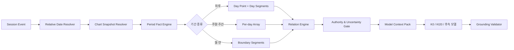

# 02. 원국 Runtime → 오늘·기간 계산 → 실제 대시보드 구현 계획

- 저장소: `sgim49697-ops/saju_diary_assistant`
- 기준 브랜치: `master`
- 기준 커밋: `9be784e4fb7f937865cdff66b95d725f61081b25`
- 기준 시각: 2026-09-02 22:34 KST
- 문서 최초 작성: 2026-09-02 11:36 KST
- 보존 기준선: `KI20-MIX-v2/run-1f5d732cae67`, `saju-runtime-release-v1.4.0-63dc8d398e90`
- 공통 상태: 기존 KI10·KI20·평가 split·sealed blind·v1.4 chart-only release는 불변 보존

## 문서 역할

이 문서는 원국 계산기의 현재 구현을 보존하면서 **오늘/특정 날짜/주말/월간 기간 계산과 실제 dashboard 기능을 추가하는 실행 정본**이다.

- 전체 제품 구조와 우선순위는 [`01_SAJU_PROJECT_MASTER_ARCHITECTURE_PLAN.md`](01_SAJU_PROJECT_MASTER_ARCHITECTURE_PLAN.md)를 따른다.
- 이 문서가 승인한 canonical chart/period/relation payload는 [`03_SAJU_MODEL_EVALUATION_AND_DATA_PLAN.md`](03_SAJU_MODEL_EVALUATION_AND_DATA_PLAN.md)의 평가와 데이터 생성 입력이 된다.
- 대운은 본 문서의 기본 구현 범위가 아니다. Day/Period 기능을 먼저 release하고 대운은 별도 정책 Gate로 분리한다.

---

## 1. 최신 상태 요약

### 1.1 이미 구현·검증된 부분

| 구성 | 현재 정본 |
|---|---|
| 원국 engine | `saju-runtime-python-v1.4.0` |
| release | `saju-runtime-release-v1.4.0-63dc8d398e90` |
| profile | `KR_CIVIL_MIDNIGHT_V1` |
| 승인 범위 | 정규화 양력 `1920-01-07~2026-08-31` |
| 승인 도구 | `calculate_saju_chart` |
| 지역 | 대한민국 도시, `Asia/Seoul` |
| 시간 입력 | exact / range / unknown |
| 불확실성 | 생시 범위·미상은 chart set과 stable facts로 처리 |
| dashboard | `phase5_dashboard_v1_11.py`, schema 1.11.0 |
| session 보호 | 분리 HMAC/AEAD key, AES-256-GCM, 30분 retention |
| 앱 canary | HTTP 100/100 + K0·KI20 동일 snapshot·비어 있지 않은 출력 |
| 운영 기본 | feature off, 명시 flag에서만 chart-only 활성화 |

현재 운영선은 dashboard v1.11이며 승인 원국 전체와 단일 일진을 실제 모델 context에 연결한다. 별도 구현된 공식 일별 기간 release, 1~31일 기간 Runtime, 단일 날짜 relation release와 dashboard v1.12·v1.13은 자동 검증을 통과한 후보이고 현재 운영 process를 자동 교체하지 않는다.

### 1.2 현재 명시적으로 차단된 부분

- dashboard v1.12·v1.13의 운영 승격
- 범위 기간에 대한 원국 관계 배열
- 관계 fact를 자연어 해석으로 승격하는 모델 Gate
- 대한민국 외 출생과 해외 timezone
- 대운·공망·12운성·합충형파해의 통합 제공
- 신강약·격국·용신·자동 사건 예측
- MIX20K-v3.1 계산 payload 재생성

현재 dashboard v1.11의 성공은 승인 원국과 단일 일진 연결 범위에 한정된다. 주·월 범위와 relation 운영 승격은 v1.12·v1.13 후보의 별도 Gate를 거쳐야 한다.

---

## 2. 현재 구현의 코드 지도

| 영역 | 현재 파일 | 역할 |
|---|---|---|
| 원국 release | `configs/runtime/calculation/releases/v1.4.0/release_registry.json` | 승인 scope·source·hash |
| 원국 engine | `scripts/runtime/calculation/engine_v1_4.py` | chart-only 실행 |
| 후보 기간 engine | `scripts/runtime/calculation/engine_v1_3.py` | period candidate |
| tool schema | `configs/runtime/tool_schema_v1.json` | chart/period tool 계약 |
| session schema | `configs/runtime/session_state_schema_v2.2.0.json` | slot·chart state |
| chart-only adapter | `scripts/runtime/chart_only_adapter.py` | event → Runtime |
| dashboard binding | `scripts/runtime/chart_only_dashboard_binding.py` | session/API 결합 |
| dashboard server | `scripts/training/phase5_dashboard_v1_11.py` | 현재 운영 HTTP·GPU·UI |
| front-end | `scripts/training/phase5_dashboard_assets/v1.11.0/` | 현재 운영 dashboard 화면 |
| canary | `scripts/evaluation/saju_runtime/chart_only_dashboard_canary.py` | 100 HTTP + GPU pair |
| 운영 문서 | `docs/runtime/chart_only_operations.md` | key·rate·rollback |
| 기간 Runtime | `scripts/runtime/period_v1/` | 단일 날짜와 1~31일 label·복원·보안 계약 |
| 관계 Runtime | `scripts/runtime/relation_v1/` | 단일 날짜의 deterministic 십신·직접 관계 |
| 후보 dashboard | `phase5_dashboard_v1_12.py`, `phase5_dashboard_v1_13.py` | 기간·관계 후보 UI와 모델 projection |

새 구현은 위 경로를 덮어쓰지 않고 `period_v1`, `relation_v1`, dashboard v1.12·v1.13 계열로 분리한다.

---

## 3. 현재 후보 기간 구현의 실제 문제

`engine_v1_3.calculate_period()`는 완전히 빈 코드가 아니다. 다음을 이미 수행한다.

- `day/week/month/year` 기간 type 검증
- `1900~2049` 범위 제한
- 시작·종료 날짜의 연·월·일간지 계산
- 기간 안의 절입 경계 반환
- `HARD_CANDIDATE` authority 부여

하지만 그대로 제품에 열 수 없는 이유가 명확하다.

### 문제 A. 시작일·종료일을 정오 한 점으로 계산

현재 코드는 시작일과 종료일 모두 `12:00`을 대표 시각으로 사용한다. 절입이 오전·오후에 있는 날은 하루 안에서 월주가 바뀔 수 있으므로 “오늘 전체”나 “이번 주말 전체”를 정오 한 점으로 대표하면 안 된다.

### 문제 B. `chart_id`가 동일 process cache에 있어야 함

현재 period 계산은 `_chart_cache`에 chart가 없으면 `CHART_NOT_IN_PROCESS`로 차단한다. 서버 재시작·다중 worker·session 복원에서 실패한다.

### 문제 C. 모델이 `chart_id`를 생성해야 하는 schema 충돌

`tool_schema_v1`은 `calculate_saju_period`의 required field로 `chart_id`를 요구하지만, 같은 schema는 `chart_id`를 model-visible result에서 숨긴다. 모델이 보지 못한 opaque ID를 정확히 생성하도록 요구하는 모순이다.

### 문제 D. 원국과 기간의 개인화 관계가 없음

현재 결과는 `start_ganzhi`, `end_ganzhi`, `jie_boundaries`까지다. 사용자의 일간 기준 기간 십신, 원국 각 기둥과의 직접 관계가 canonical payload로 존재하지 않는다.

### 문제 E. 미래 authority가 chart release와 혼합됨

v1.4는 과거 공식 원국만 승인했다. 오늘 이후 기간은 과거 `HARD_GT`와 동일한 등급이 아니라 별도 forecast authority가 필요하다.

### 문제 F. 범위 질의를 일별 배열·segment로 표현하지 않음

“이번 주말”은 최소 2일, “이번 달”은 여러 일과 절입 segment를 가져야 한다. 시작·종료 두 점만으로는 UX와 해석 grounding이 부족하다.

### 문제 G. 대운을 요구하는 질문과 단기 기간 질의를 구분하지 않음

오늘·주말은 대운 없이도 제공할 수 있다. 10년 흐름은 대운 policy가 필요하다. 하나의 period tool로 섞으면 release가 계속 막힌다.

---

## 4. 목표 Runtime 구조



### Runtime 결과 3종

1. `chart_snapshot`: 출생 원국과 stable facts
2. `period_snapshot`: 특정 시점·기간의 세운·월운·일운
3. `relation_snapshot`: chart와 period 사이의 deterministic 관계

모델은 이 3개 snapshot의 allowlist만 읽는다.

---

## 5. 새 release를 단계적으로 분리

### Release P0 — 기존 chart-only v1.4 보존

- 코드를 수정하지 않는다.
- regression baseline으로 유지한다.
- 기존 canary와 hash chain을 새 period release의 선행조건으로만 참조한다.

### Release P1 — `saju-period-day-v0.1`

구현 상태: 공식 일별 label release와 전수 conformance가 완료됐다.

지원:

- 오늘
- 내일·어제
- 특정 날짜 1일
- 해당 날짜의 일간지
- 기준 instant의 세운·월운
- source·profile·forecast authority
- 절입 경계에 가까운 경우 복수 segment 또는 warning

제외:

- 대운
- 장기 사건 예측
- 월 전체 요약
- 합충 길흉 우선순위

### Release P2 — `saju-period-range-v0.2`

구현 상태: 길이 1~31일의 연속 날짜 label과 dashboard v1.12 후보가 검증됐다.

추가:

- 이번 주말
- 이번 주
- 지정 2~31일
- 이번 달
- 날짜별 `days[]`
- 절입 경계별 `segments[]`
- 지원 범위와 최대 일수 제한

### Release P3 — `saju-natal-period-relations-v0.1`

구현 상태: 단일 날짜 relation release와 dashboard v1.13 후보가 검증됐다. 범위 relation은 계속 차단한다.

추가:

- 기간 천간의 일간 기준 십신
- 기간 지지 본기의 일간 기준 십신
- 원국 각 기둥과 직접 합·충·형·파·해 존재
- 동일 간·지 반복 여부
- relation table version과 policy ID

제외:

- 관계 우선순위
- 합화 성립 자동 단정
- “이별·사고·합격” 같은 사건 변환
- 신강약·용신 기반 점수

### Release P4 — Dashboard period feature v2.0

- P1~P3가 모두 Gate를 통과한 조합만 활성화한다.
- 대운은 `capability=false`로 표시한다.

---

## 6. Tool schema v2 권장안

기존 `saju-tools-v1`은 불변 보존한다. 새 파일을 만든다.

```text
configs/runtime/tool_schema_v2.json
```

### 6.1 모델이 생성하는 period 인수

```json
{
  "period_type": "day",
  "date_expression": "today",
  "start_date": null,
  "end_date": null,
  "detail_level": "summary"
}
```

규칙:

- `date_expression`: `today | tomorrow | yesterday | this_weekend | this_week | this_month | explicit`
- `explicit`일 때만 `start_date/end_date` 사용
- 모델은 timezone·chart ID·policy ID·session revision을 생성하지 않는다.

### 6.2 Executor가 주입하는 값

```json
{
  "chart_id": "sc2_...",
  "chart_snapshot_sha256": "...",
  "timezone": "Asia/Seoul",
  "reference_datetime": "2026-09-02T11:36:00+09:00",
  "period_policy_id": "KR_PERIOD_CIVIL_V1",
  "session_revision": 12,
  "tool_schema_version": "saju-tools-v2"
}
```

### 6.3 chart tool 교정

`gender_for_daeun`은 원국 계산의 필수 입력이 아니다. 기존 v1은 보존하되 v2에서는:

- `calculate_saju_chart`: gender를 optional 또는 제거
- `calculate_saju_daeun`: 향후 별도 tool에서 gender/policy 사용

으로 나눈다.

---

## 7. Relative Date Resolver

모델이 날짜 산술을 직접 하지 않도록 Runtime에서 처리한다.

| 표현 | 기준 | 결과 |
|---|---|---|
| 오늘 | session timezone의 현재 날짜 | 1일 |
| 내일·어제 | 현재 날짜 ±1 | 1일 |
| 이번 주말 | locale policy의 다음/현재 토·일 | 2일 |
| 이번 주 | 월요일~일요일 | 최대 7일 |
| 이번 달 | 현지 달력 1일~말일 | 최대 31일 |
| 2026년 9월 8일 | 명시 날짜 | 1일 |

필수 저장:

```text
original_expression
reference_datetime
resolved_start_date
resolved_end_date
timezone
resolver_policy_id
```

Gate:

- 같은 `reference_datetime`이면 OS·host timezone과 무관하게 동일 결과
- “이번 주말”의 locale policy version 고정
- 날짜 경계 직전/직후 fixture
- 잘못된 날짜·역순 범위 차단

---

## 8. Chart snapshot 복원 전략

### 8.1 권장 1차 방식: deterministic 재계산

```text
암호화 session의 normalized birth input
→ 같은 release/profile/source로 chart 재계산
→ 저장된 chart fingerprint와 비교
→ 일치할 때만 period 계산
```

장점:

- process cache 불필요
- worker 재시작에 안전
- chart release가 바뀌면 mismatch를 명시적으로 탐지

### 8.2 2차 최적화: signed snapshot

성능이 실제 병목일 때만 도입한다.

```text
canonical chart facts
+ release/profile/source versions
+ HMAC signature
```

단순 `chart_id`만 저장하고 신뢰하지 않는다.

---

## 9. Period result schema

```json
{
  "status": "ok_with_warning",
  "period_scope": {
    "type": "day",
    "start": "2026-09-02T00:00:00+09:00",
    "end": "2026-09-02T23:59:59+09:00",
    "reference_datetime": "2026-09-02T11:36:00+09:00"
  },
  "temporal_facts": {
    "year": {"ganzhi": "...", "authority": "FORECAST_PROFILE_DETERMINISTIC"},
    "month": {"ganzhi": "...", "authority": "FORECAST_PROFILE_DETERMINISTIC"},
    "days": [
      {"date": "2026-09-02", "ganzhi": "...", "authority": "SOURCE_HARD_FACT"}
    ]
  },
  "segments": [],
  "uncertainty": {
    "near_jie_boundary": false,
    "uncertainty_seconds": 0
  },
  "period_id": "sp1_...",
  "policy_id": "KR_PERIOD_CIVIL_V1",
  "engine_version": "saju-period-python-v0.1.0",
  "source_versions": {},
  "warnings": [],
  "limitations": ["미래 사건을 확정적으로 예측하지 않습니다."]
}
```

### 절입이 포함된 날

```json
{
  "date": "2026-09-07",
  "segments": [
    {"start": "00:00:00+09:00", "end": "11:21:59+09:00", "month_ganzhi": "..."},
    {"start": "11:22:00+09:00", "end": "23:59:59+09:00", "month_ganzhi": "..."}
  ]
}
```

정오 한 점으로 하루 전체를 대표하지 않는다.

---

## 10. Relation result schema

```json
{
  "relation_snapshot_id": "sr1_...",
  "chart_id": "sc2_...",
  "period_id": "sp1_...",
  "day_master": "壬",
  "period_ten_gods": {
    "year_stem": "...",
    "month_stem": "...",
    "day_stem": "...",
    "day_branch_main_hidden_stem": "..."
  },
  "direct_relations": [
    {
      "period_part": "day_branch",
      "natal_pillar": "day",
      "relation": "충",
      "authority": "PROFILE_DETERMINISTIC",
      "table_version": "branch-relations-v1"
    }
  ],
  "interpretation_not_included": true
}
```

Runtime은 “충이 존재한다”까지만 말한다. “갈등이 생긴다”, “헤어진다”는 사실 필드에 넣지 않는다.

---

## 11. Dashboard v2.0 UX

### 11.1 기본 화면 구조

```text
[대화]
[내 원국] [오늘] [기간] [기록] [진단]
```

- `내 원국`: 기존 chart-only card
- `오늘`: 오늘 날짜·세운·월운·일운·관계 fact·해석
- `기간`: 주말·주간·월간 선택
- `기록`: 사용자의 일기·체감 체크, 사주 계산과 분리
- `진단`: 로컬 관리자 모드에서만 K0↔KI20 비교

### 11.2 오늘 카드

표시 순서:

1. 기준 날짜·timezone
2. 계산 fact 요약
3. 원국과의 관계 2~4개
4. 모델의 참고 해석
5. 사용자가 남기는 체감 체크

### 11.3 authority 표시

사용자에게 내부 코드를 그대로 보이지 않되 의미는 구분한다.

- 공식 달력 사실
- 선택한 계산 정책 기준
- 해석 참고
- 경계 근처라 결과가 달라질 수 있음

### 11.4 생시 미상

- 원국 stable facts만 사용
- 시주 의존 relation 제외
- “시간을 모르므로 시주 관련 해석은 제외했습니다”를 한 번만 표시

### 11.5 대운

대운 탭을 미리 만들지 않거나, 만들 경우 명확히 `준비 중`으로 잠근다. 임시 계산값을 보여주지 않는다.

---

## 12. API·Session 통합

현재 네 route를 유지하는 방향을 우선한다.

```text
GET    /api/runtime/status
POST   /api/runtime/sessions
POST   /api/runtime/sessions/{session_id}/events
DELETE /api/runtime/sessions/{session_id}
```

`events`의 versioned type을 확장한다.

```text
set_birth_input
calculate_chart
request_period
clear_period
ask_model
record_diary_feedback
```

### Session state v2.3 후보

```json
{
  "revision": 12,
  "birth_state": {},
  "chart_snapshot": {},
  "period_request": {},
  "period_snapshot": {},
  "relation_snapshot": {},
  "reference_clock": {},
  "model_context": {
    "context_id": "...",
    "snapshot_hashes": []
  }
}
```

필수 규칙:

- stale revision → `409`
- Runtime busy → `429 + Retry-After`
- period 요청은 chart snapshot이 없으면 intake로 회귀
- model process에 HMAC capability·출생 원문·ciphertext를 전달하지 않음
- 로그에는 route template·status·reason만 남김

---

## 13. Context Builder

모델에는 원본 Runtime JSON 전체가 아니라 compact allowlist를 전달한다.

```json
{
  "user_intent": "today_fortune",
  "chart_facts": {},
  "period_facts": {},
  "relations": {},
  "uncertainty": {},
  "response_constraints": {
    "do_not_invent_facts": true,
    "do_not_predict_events_as_certain": true,
    "focus": ["work", "relationships"]
  }
}
```

같은 context pack을 K0와 KI20에 넣어 문서 03의 paired 평가가 가능하게 한다.

---

## 14. Validator

최소 차단 규칙:

- context에 없는 천간·지지·십신·날짜 생성
- 생시 미상인데 시주 확정
- tool 실패 후 “계산 완료” 주장
- period snapshot 없이 오늘·월운 간지 주장
- `direct_relations`에 없는 합충 생성
- 해석 문장을 deterministic fact처럼 표현
- 건강·재정·법률 결정을 사주 하나로 단정

Validator가 답변을 완전히 다시 쓰기보다 오류 코드와 재생성 조건을 반환한다.

---

## 15. Period Dashboard Canary 200건

| 층 | 건수 | 핵심 확인 |
|---|---:|---|
| feature off | 10 | period flag 없으면 차단 |
| 정상 day | 20 | 오늘·특정일 fact |
| 상대 날짜 | 20 | today/tomorrow/weekend |
| 주말·주간·월간 | 20 | per-day 배열·범위 제한 |
| 절입 경계 | 30 | 전·경계·후 segment |
| session 복원 | 20 | process restart·재계산 |
| 보안·변조·rate | 30 | Origin·CSRF·HMAC·429·409 |
| no-chart·지원 밖 | 20 | intake 복귀·range 차단 |
| K0·KI20 동일 context | 10 | context hash 동일 |
| 공개 누출 | 20 | 출생값·ID·secret·원시 출력 없음 |
| **합계** | **200** |  |

### Runtime Gate

- hard/forecast fact 미분류 mismatch `0`
- 일진 fixture mismatch `0`
- 절입 segment mismatch `0`
- host timezone drift `0`
- process restart chart 복원 성공 `100%`
- 모델 생성 `chart_id` 사례 `0`
- 생시 미상 시주 생성 `0`
- silent fallback `0`
- heuristic leakage `0`
- raw private leakage `0`

---

## 16. 구현 Phase

R0~R8의 후보 구현·자동 conformance·canary는 완료했다. 이 완료는 dashboard v1.12·v1.13의 production 승격을 뜻하지 않으며, 현재 운영 v1.11과 feature 기본 off는 유지한다.

### R0. 기준선 검증

- latest master·release·canary hash 확인
- 기존 v1.4와 dashboard v1.9 byte 변경 0 확인

### R1. Period 계약

새 파일:

```text
configs/runtime/period/
├── period_contract-v0.1.0.json
├── period_output_schema-v0.1.0.json
├── relative_date_policy-v2.0.0.json
├── authority_policy-v1.0.0.json
└── releases/
```

### R2. Chart resolver

- process cache 제거
- 암호화 state → 재계산 → fingerprint 대조

### R3. Day-only engine

- day/year/month fact
- exact instant
- 경계 warning
- source versions

### R4. Range/segment engine

- per-day array
- jie boundary segmentation
- 기간 상한

### R5. Relation engine

- ten-god lookup 전수 테스트
- branch relation table
- interpretation firewall

### R6. Tool/session v2

- executor-injected chart ID
- session schema v2.3
- context builder

### R7. Dashboard v2.0

- today/period UI
- capabilities status
- diagnostic compare 분리

### R8. Canary·rollback

- 200건 canary
- feature default off
- 실패 시 기존 chart-only v1.9로 rollback

### R9. 문서 03 handoff

다음 불변 산출물을 모델·데이터 workstream에 넘긴다.

```text
period release registry
period fixture/report
relation release registry
context pack schema
model-visible allowlist
canary aggregate/manifest
```

---

## 17. Codex 실행 지시

1. 기존 chart-only v1.4 파일은 수정하지 말고 새 version을 만든다.
2. `engine_v1_3.calculate_period()`를 그대로 승격하지 않는다.
3. 날짜 대표값으로 무조건 정오를 쓰지 않는다.
4. `chart_id`는 모델 argument가 아니라 executor-injected field로 옮긴다.
5. period engine과 relation engine을 한 파일에 섞지 않는다.
6. 대운·용신·격국을 이번 구현에 넣지 않는다.
7. fixture 없이 외부 엔진 값만 비교해 승인하지 않는다.
8. 기존 dashboard 네 route를 우선 유지하고 event schema를 versioning한다.
9. 각 Phase마다 단위 테스트와 공개 aggregate를 만든 뒤 작은 commit으로 남긴다.
10. 검증된 relation payload를 넘는 `MIX20K-v3.1` 생성이나 대규모 학습은 별도 Gate 전 호출하지 않는다.

---

## 진행 기록

### 2026-09-02 — 기간·관계 후보 구현 상태 반영

- 작업 요약: 공식 일별 기간 release, 1~31일 기간 Runtime, 단일 날짜 relation release와 dashboard v1.12·v1.13 후보의 병합 상태를 반영했다.
- 변경 범위: 기존 v1.4 원국과 운영 dashboard v1.11은 그대로 두고 후보 구현·차단 경계만 문서화했다.
- 검증: 기간·관계·dashboard·project status 표적 unittest 51건과 최신 `master` 가상 병합 검사를 통과했다.
- 남은 작업: 후보 dashboard 운영 승격, 범위 relation, 모델 5-arm 평가와 product canary는 별도 승인 대상이다.

---

## 18. 내부 근거 파일

- `configs/runtime/calculation/releases/v1.4.0/release_registry.json`
- `scripts/runtime/calculation/engine_v1_3.py`
- `scripts/runtime/calculation/engine_v1_4.py`
- `configs/runtime/tool_schema_v1.json`
- `configs/model_versions/saju_1b_baseline/phase5-dashboard-v1.9.0.json`
- `docs/runtime/chart_only_operations.md`
- `docs/runtime/known_limitations.md`
- `data/reports/saju_runtime_dashboard_canary/v1.0.0/build-ea53c272c1d6/aggregate.json`

## 19. 외부 참고

- KASI 음양력 정보: https://www.data.go.kr/dataset/15012679/openapi.do
- KASI 특일·24절기 정보: https://www.data.go.kr/data/15012690/openapi.do
- IANA tzdb release: https://www.iana.org/time-zones/releases
- Python `zoneinfo` fold·tzdata: https://docs.python.org/3/library/zoneinfo.html
